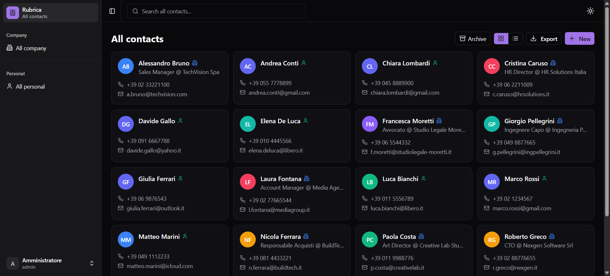
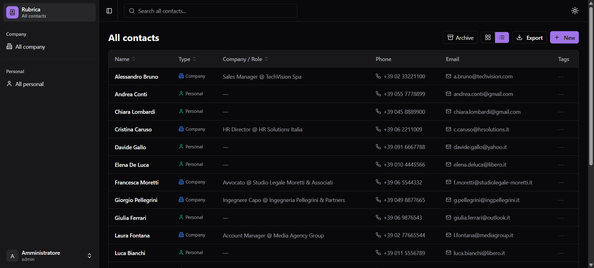
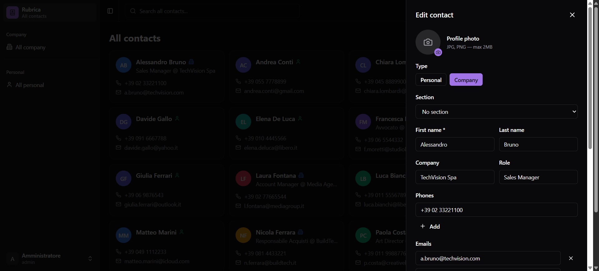

# Rubrica

[](LICENSE)
[](docker-compose.yml)
[](https://vuejs.org)
[](https://nestjs.com)
[](README.md)

Applicazione web self-hosted per la gestione dei contatti personali e aziendali.

## Screenshots

**Vista principale — card**


**Vista principale — tabella**


**Dettaglio contatto**


## Funzionalità

- **Contatti** — nome, telefoni, email, sito, foto, indirizzo, note, tag, sezioni
- **Tipi** — contatti personali (per utente) e aziendali (condivisi tra tutti)
- **Sezioni** — organizza i contatti in categorie personalizzabili con icone
- **Tag** — etichette libere per filtrare rapidamente
- **Archivio** — archivia i contatti senza eliminarli
- **Export** — esporta in formato `.xlsx` o `.vcf`
- **Multi-utente** — ogni utente ha i propri contatti personali; gli admin gestiscono quelli aziendali
- **i18n** — interfaccia in italiano e inglese, rilevamento automatico dalla lingua del browser
- **Tema** — modalità chiara, scura e automatica; 5 palette colori
- **Preferenze** — lingua e tema salvati per utente e sincronizzati tra dispositivi

## Requisiti

- [Docker](https://docs.docker.com/get-docker/) e [Docker Compose](https://docs.docker.com/compose/)

## Installazione

```bash
git clone https://github.com/<tuo-utente>/rubrica.git
cd rubrica
docker compose up -d
```

Apri il browser su **http://localhost** e segui il wizard di configurazione iniziale:

1. **Database** — scegli SQLite (consigliato per uso locale, zero configurazione) o PostgreSQL (consigliato per produzione)
2. **Account admin** — crea il primo utente amministratore

Il JWT secret viene generato automaticamente al primo avvio e salvato in `data/secret.key`.

## Aggiornamento

```bash
git pull
docker compose build
docker compose up -d
```

I dati sono persistiti nel volume Docker `rubrica-data` e non vengono toccati dall'aggiornamento.

## Configurazione avanzata

Le opzioni si trovano in `docker-compose.yml`. I parametri più comuni:

| Variabile | Descrizione | Default |
|---|---|---|
| `JWT_SECRET` | Secret JWT (se non impostato, auto-generato) | *(auto)* |
| `PORT` | Porta del backend | `3000` |
| `CORS_ORIGIN` | Origine CORS consentita | `http://localhost:5173` |
| `DB_TYPE` | `sqlite` o `postgres` | `sqlite` |
| `DB_PATH` | Percorso file SQLite | `/app/data/rubrica.db` |
| `DB_HOST` | Host PostgreSQL | `localhost` |
| `DB_PORT` | Porta PostgreSQL | `5432` |
| `DB_USER` | Utente PostgreSQL | `rubrica` |
| `DB_PASS` | Password PostgreSQL | — |
| `DB_NAME` | Nome database PostgreSQL | `rubrica` |

> Le variabili di ambiente hanno la precedenza sulla configurazione salvata dal wizard.

### Esempio con PostgreSQL esterno

```yaml
# docker-compose.yml
services:
  backend:
    environment:
      - DB_TYPE=postgres
      - DB_HOST=db.example.com
      - DB_PORT=5432
      - DB_USER=rubrica
      - DB_PASS=password_sicura
      - DB_NAME=rubrica
      - JWT_SECRET=stringa-casuale-molto-lunga
```

### Esporre su una porta diversa

```yaml
services:
  frontend:
    ports:
      - "8080:80"
```

## Struttura dati persistiti

Il volume `rubrica-data` (montato su `/app/data` nel container) contiene:

```
data/
├── rubrica.db      # Database SQLite (se usato)
├── config.json     # Configurazione DB scelta nel wizard
├── secret.key      # JWT secret auto-generato
└── uploads/        # Foto dei contatti
```

## Stack tecnologico

| Layer | Tecnologia |
|---|---|
| Frontend | Vue 3 + TypeScript + Vite + Tailwind CSS |
| Backend | NestJS + TypeORM |
| Database | SQLite (default) / PostgreSQL |
| Auth | JWT (Bearer token) |
| Deploy | Docker Compose |

## Licenza

MIT
